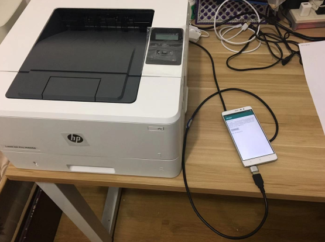
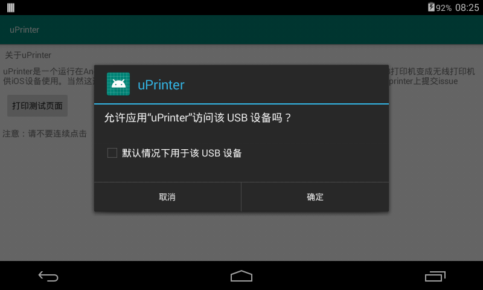
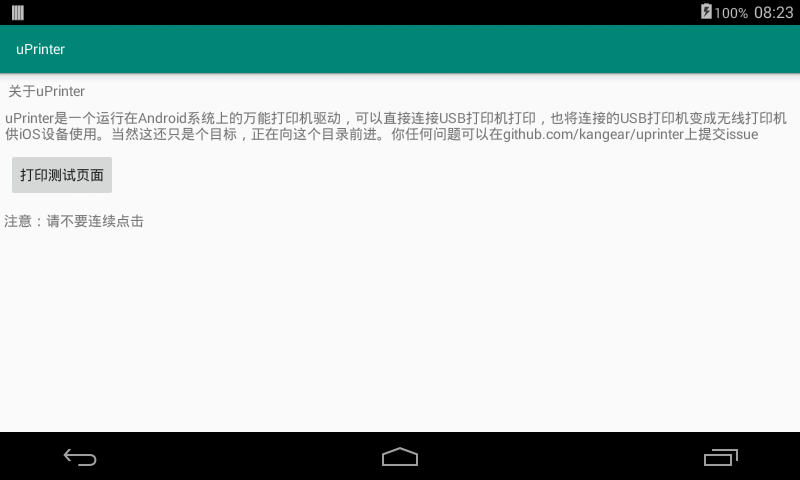

# uPrinter
uPrinter是一个Android上的打印驱动APK，计划实现支持USB打印，尽可能地支持更多型号USB打印机。
1. 支持Android4.4+打印服务。可以直接通过Android手机OTG连接USB打印机进行打印；
2. 支持AirPrint协议，使得同局域网的iOS设备能够直接无线打印；

这是我的想法，我将加快速度实现这一想法。

# 系统要求
1. Android 4.4以上
2. 支持OTG

# 下载uPrinter.apk
https://github.com/kangear/uPrinter/releases  
点击apk下载即可，安装到Android设备上；
(后续会上传到)

# 硬件连接

# 启动uPrinter
## 允许uPrinter访问USB设备

## 点击打印测试页面

